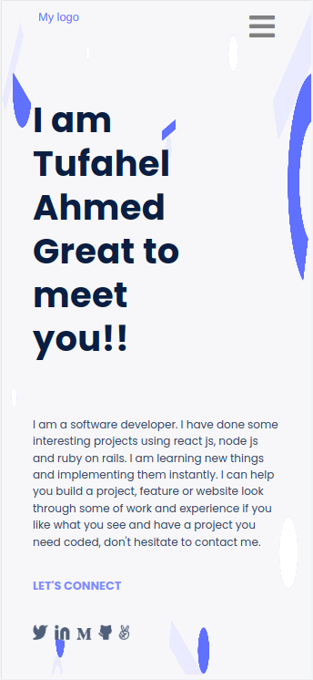
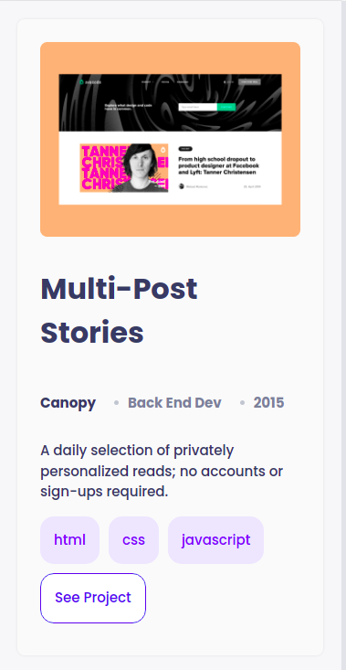
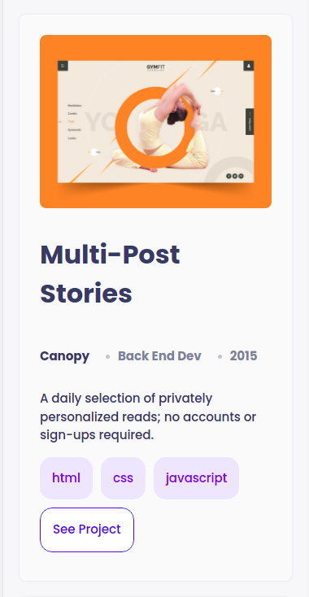
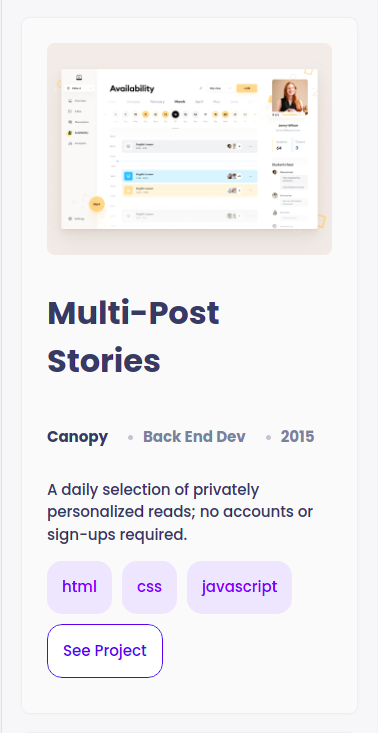
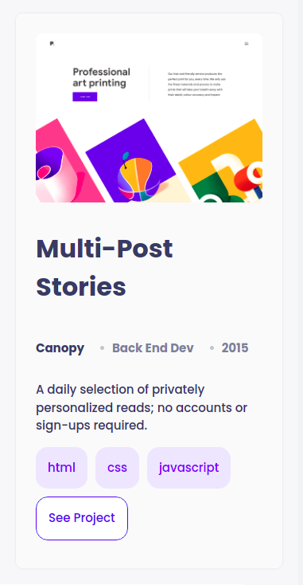
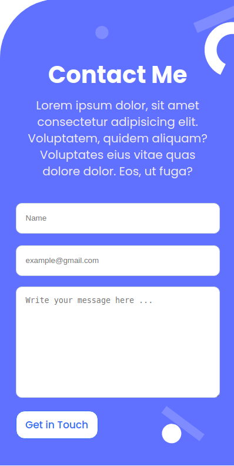

# Developers Portfolio of Tufahel Ahmed

This is a portfolio work experienc section of Tufahel Ahmed. Tufahel Ahmed is coding science 2017. He has coding experience on C,C++,Java,HTML,CSS,REACT and a little bit NodeJs. He has developed some websites for personal experience and use.

# Getting Started
To get a local copy up and running follow these simple example steps.

- Download this git repo.
- Extract this git copy.
- Open index.html file with google chrome.

# Pic

- First page
- 

- Second page
- 

- Third page
- 

- Fourth page
- 

- Fifth page
- 

- AboutMe page
- 

- ContactMe page
- 

## Built With

- HTML/CSS

## Authors

👤 Author1

- GitHub: @Tufahel
- LinkedIn: Tufahel Ahmed
